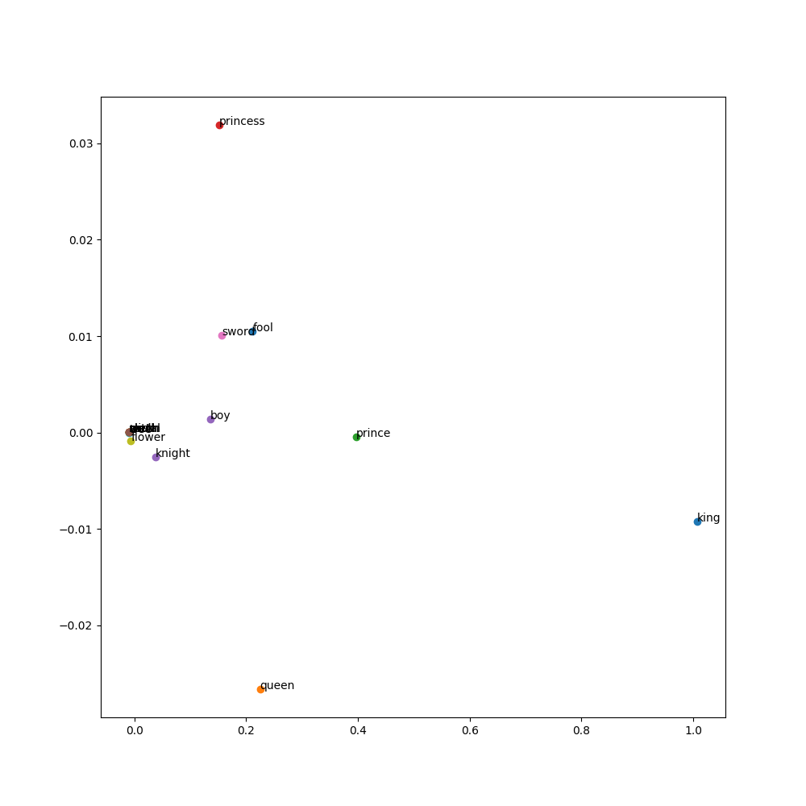

# word_2_vec
This is a project to experiment with developing a word2vec model as part of learning about AI and transformers using pytorch.

# Goals of this project
The aim of this project was to act as a simple exploratory project to practice building a fairly fundamental tool in NLP.

I learned the concepts behind the word2vec model, and while it was fairly understandable I wanted to see how it would translate to code.

I also got to practice working more with the pytorch library as a result, which was a big win.

The biggest challenge for me in building this was getting the vector dimensions right for matrix multiplication. Learning to respect that process and approach it slowly was valuable.

# How to use this project

All of the code for this project in is in the explore_word2vec.ipynb notebook. 

This was intended to primarily be a learning experiment and potentially a teaching resource for anyone interested in this kind of model.

Any feedback, comments or questions are welcome at bwm.sturgeon@gmail.com

# 
Sources:

https://towardsdatascience.com/creating-word-embeddings-coding-the-word2vec-algorithm-in-python-using-deep-learning-b337d0ba17a8

https://www.deeplearningwizard.com/deep_learning/practical_pytorch/pytorch_logistic_regression/#step-3-building-model